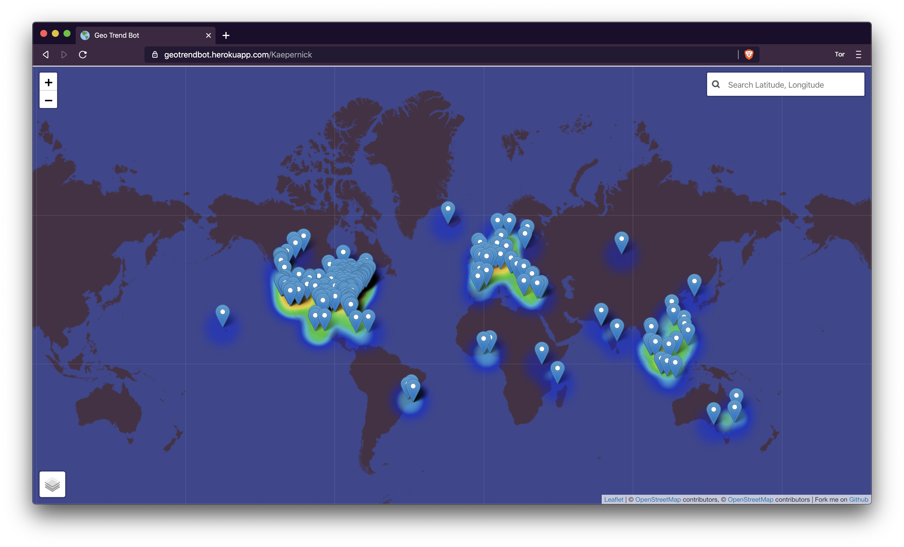
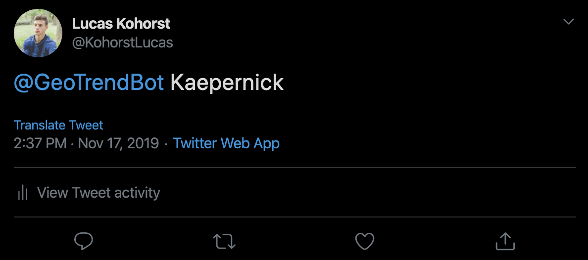

Geo Trend Bot
============

[](https://github.com/Lucas-Kohorst/geotrendbot/stargazers) [](https://github.com/Lucas-Kohorst/geotrendbot/issues) [](https://geotrendbot.herokuapp.com)
 
Visualize trends on Twitter by navigating to [GeoTrendBot](https://geotrendbot.herokuapp.com) or tweeting [@geotrendbot](https://twitter.com/geotrendbot) with a hashtag.



---

## [Depreceated] The Twitter Developer account for this project has been suspended (Not sure why) but you can continue to build and improve the product if you wish

## Features
- Tweet at the bot receive a link to a Heat Map of tweets from the past 7 days
- View popular trends
- Visualize locations of tweets

---

## Setup
Clone this repo to your desktop

```
git clone https://github.com/Lucas-Kohorst/GeoTrendBot.git
cd geotrendbot
```

### Twitter Setup
First sign up and create a [Twitter Developer account](https://developer.twitter.com/en/apply-for-access.html) this could take a few days to be approved .

Get your API keys and create a file ```.config.js``` in the root folder. The config file should look like this 

```
module.exports = {
    config: {
        consumer_key: "consumer_key",
        consumer_secret: "consumer_secret",
        access_token_key: "access_token_key",
        access_token_secret: "access_token_secret"
    }
};
```

Build and run the server. This will run on ```localhost:5000```

```
npm i && npm start
```

Build and run the client. This will run on ```localhost:3000```
```
cd client
npm i && npm start
```

Build and run the Twitter mention's streamer. First change the account that is being tracked in ```twitterStream/monitorMentions.js```

```
//Setting up a user stream
var stream = T.stream("statuses/filter", {
    track: "@GeoTrendBot"
});
```

Build and run the Twitter mention streamer 
```
cd twitterStream
npm i && npm start
```

You should see ```The bot is starting``` if everything is set up correctly. 

You can run the client and server with one command using 
```
npm run dev
```

---

## Usage
Navigate to ```localhost:3000``` to view top trends and recent tweets. Or navigate to ```localhost:3000/{trend}``` where the trend is what you would like to visualize. 

If you have the Twitter Bot set up with the mention server running tweet at your bot with a hashtag. To receive a url to the visualization.



---

## License
>You can check out the full license [here](https://github.com/Lucas-Kohorst/geotrendbot/blob/master/LICENSE)

This project is licensed under the terms of the **MIT** license.

## Roadmap
See the [open issues](https://github.com/Lucas-Kohorst/geotrendbot/issues) for a list of proposed features (and known issues).

## Contributing

Feel free to fork, open pull requests and contribute to this project

1. Fork the Project
2. Create your Feature Branch (`git checkout -b feature/<feature>`)
3. Commit your Changes (`git commit -m 'Useful description of the feature'`)
4. Push to the Branch (`git push origin feature/<feature>`)
5. Open a Pull Request

## Contact
[@KohorstLucas](https://twitter.com/KohoestLucas)<br />
[kohorstlucas@gmail.com](mailto:kohorstlucas@gmail.com)

<a href="https://www.producthunt.com/posts/geotrendbot?utm_source=badge-featured&utm_medium=badge&utm_souce=badge-geotrendbot" target="_blank"></a>
